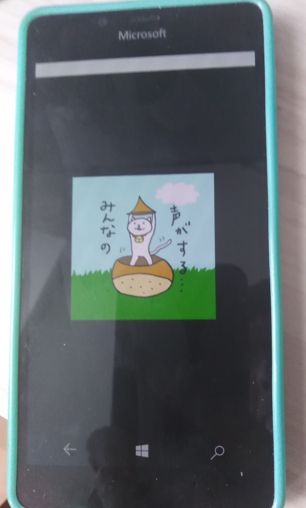

# CocosSharpTests

CocosSharp XNA (MonoGame) RnD & Testing (UWP platform addition/implementation where MonoGame runs)

## Status / Progress
- UWP target added; Test "Example1" added too
- Build compiled at/by now. :)
- Doing more research & fixing "app logics" ...

## ToDo
Migrate all portable projects onto .NET standard "world".

## References / Credits
- https://github.com/andywcoder/CocosSharp	
- https://github.com/andywcoder
- https://github.com/xamarin/cocossharp (https://github.com/mono/CocosSharp clone; archived)

## ..
AS IS. No support. RnD only!

## .
[m][e] 2023